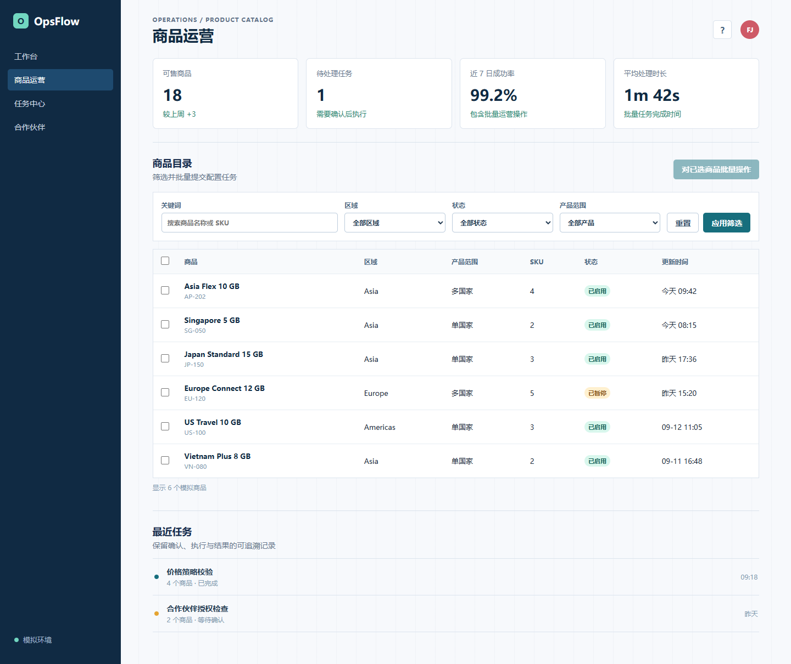

# OpsFlow Batch Automation Demo

一个面向作品集的 B2B 运营后台自动化演示。项目使用虚构品牌、模拟商品和本地状态，展示如何把高风险的批量业务操作拆成可审阅、可确认、可验证的端到端流程。



## 演示范围

- 商品目录筛选：关键词、区域、状态、产品范围
- 批量选择：支持当前筛选结果全选和清除选择
- 三步批量流程：选择范围 -> 设置操作 -> 预览确认
- 两类操作：批量经营配置、批量授权分发
- 动态确认短语：确认短语匹配前不能提交
- 异步完成状态：创建任务后显示完成反馈，并写入任务记录
- Playwright E2E：覆盖筛选、经营配置、授权分发和最终完成断言

## 本地运行

```bash
npm install
npm run dev
```

打开 `http://127.0.0.1:4173`。

## 自动化验证

```bash
npm run test:e2e
```

脚本会启动独立的本地服务并执行以下链路：

1. 筛选亚洲单国家产品。
2. 全选筛选结果。
3. 完成批量经营配置，读取动态确认短语并断言任务完成。
4. 再次全选结果。
5. 完成批量授权分发，读取动态确认短语并断言任务完成。
6. 输出 `artifacts/e2e-success.png` 与 `artifacts/e2e-summary.json`。

默认使用本机 Microsoft Edge；如需使用 Playwright Chromium，可设置
`PLAYWRIGHT_CHANNEL=chromium`。GitHub Actions 已配置为使用 Chromium 运行同一条链路。

## 作品集说明

本项目只用于展示工程方法，未包含任何真实公司名称、业务域名、账号、接口、商品数据、运行截图或内部确认信息。

可以在简历中描述为：

> **B2B 商品运营后台批处理自动化演示** | JavaScript · Playwright  
> 搭建模拟运营后台并实现端到端自动化，覆盖多条件筛选、批量经营配置、授权分发、动态确认短语和异步任务完成断言；通过截图与结构化结果留存，提高高风险批量操作的可追溯性。

## 部署

这是一个纯静态前端，可直接部署到 Vercel、Netlify 或 GitHub Pages。

```bash
npx vercel --prod
```

部署前，请先在本机完成 Vercel 登录。仓库中不包含密钥或环境变量。
